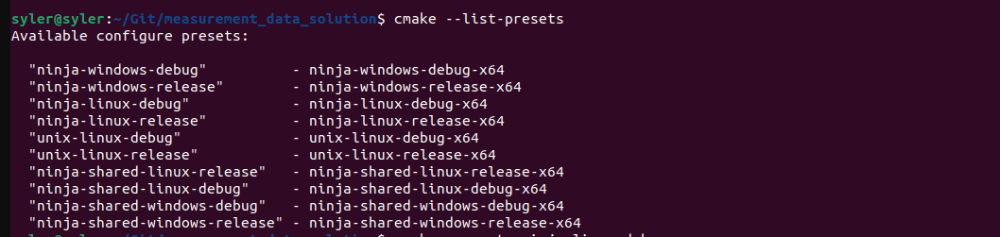
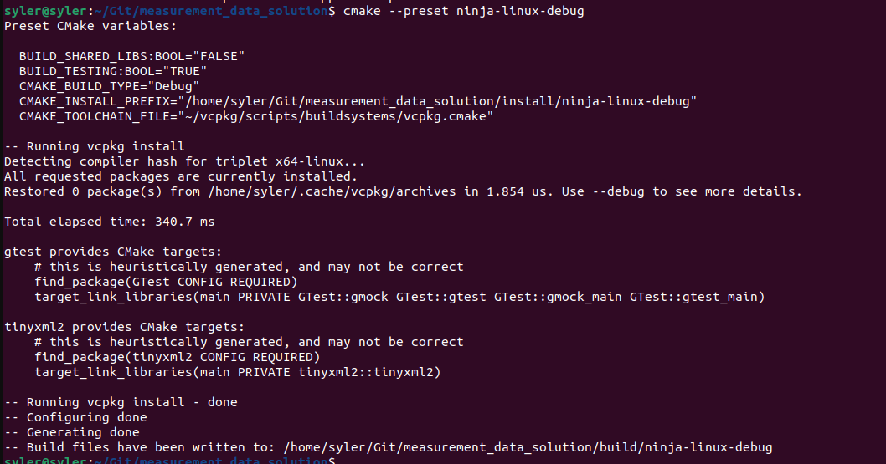
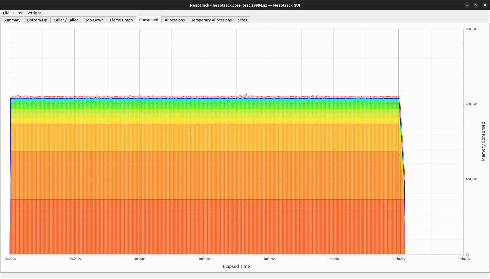
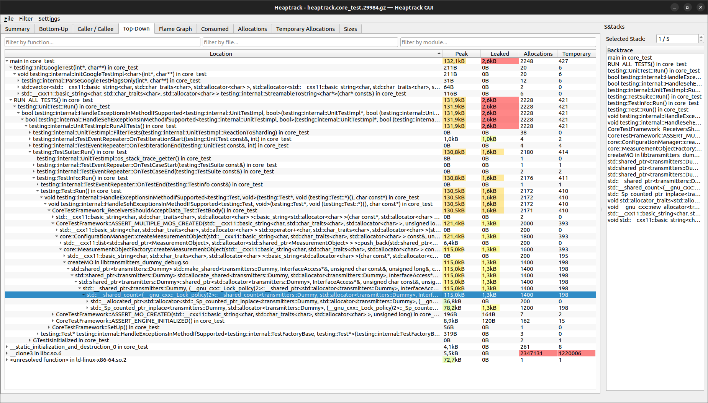
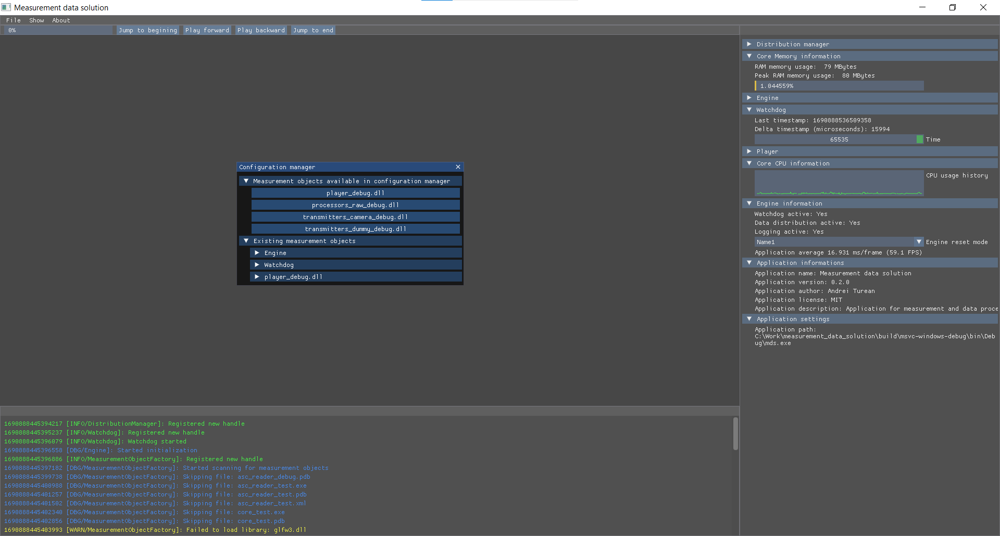
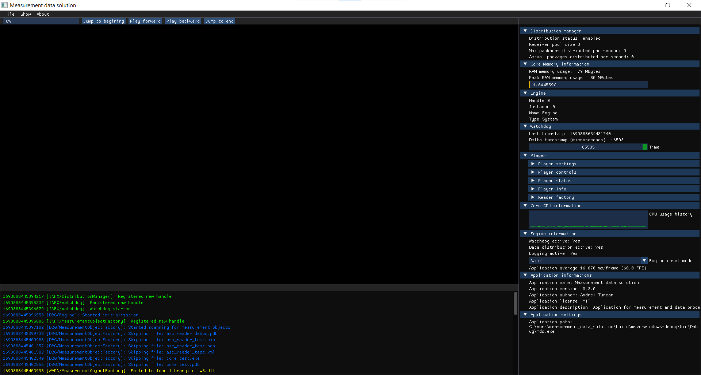

# Prerequisites for building this project

[Back](./README.md)

## VCPKG
*	VCPKG is used package management. It helps us manage our dependecies in order to create a cross platform and cross compile project.
*	VCPKG reduce the need of having already installed packages, for example google test, and get them if you require them.

##	CMake
*	CMake will generate the build system and will help us develop cross platform applications.

##	Git
##	WS:
*	WSL will be used for cross compiling.

##  ImGui
### GLFW3
*   Used with ImGui
### GLAD
*   Used with ImGui
### SDL2
*   Used with ImGui
## ElfUtils
*   This is mandatory only for linux users.

## Other linux dependencies:
*   xorg-dev
*   libwayland-dev
*   libxkbcommon-dev
*   wayland-protocols
*   extra-cmake-modules

For installation the above dependencies use the following commands:
*   sudo apt install xorg-dev
*   sudo apt install libwayland-dev libxkbcommon-dev wayland-protocols extra-cmake-modules

## Doxygen
*   Used for generating the documentation. Each target is presented with a doxy file
# How to build the project

After all the prequisites are fullfilled, then you can proceed to select one CMake preset, keep in mind that you need to get one that will suite your machine, and run the CMake command using the preset. 
See example of how to see all the availabe presets:

Then choose one preset that fitst your machine and run it:

## Integration with Visual Studio Code

In order to integrate the build of the framework with visual studio code, you need first of all install the CMake package from the package exteensions.

## Integration with Visual Studio

Assuming that you have a modern Visual Studio, it should already be integrated. What you will need to do more is to configure your WSL in order to run the code using the Ubuntu Kernel.

# Project peformance report

## CORE memory analysis tests
### Memory allocation for 200 instances of transmitters and one receiver (build 220905):

### Memory leaks for 200 instances of transmitters and one receiver (build 220905):

# Project demo

[Project structure and informtation](./source/README.md)

