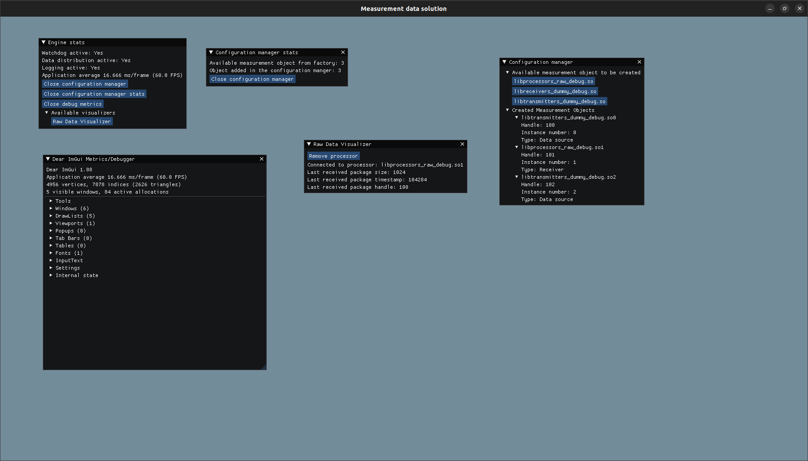

# MDS application readme

[Back](../README.md)

The MDS is the main GUI of the MDS framework. It is responsable to consume the engine and the create visualization measurement objects based on the objects received from the engine.

Example:

Each Measurement object will have its GUI representativ where all the properties can be seen. This topic is still in todo and discussed.